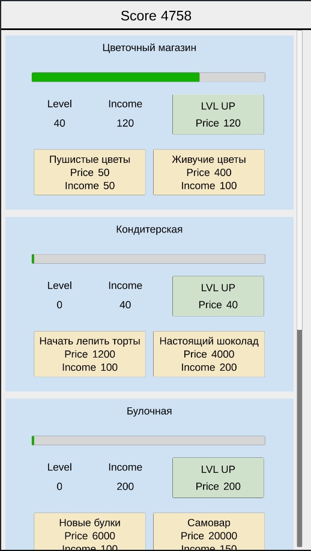

# BusinessClicker

  

Кликер, в котором игрок покупает и улучшает бизнесы, генерирующие доход. 

В коде использован фреймворк LeoEcsLite.

Реализованные фичи:
1. При выходе игра сохраняется.
2. Данные бизнесов можно менять через конфиги в виде ScriptableObject.
3. Каждому бизнесу можно купить по два уникальных улучшения.
4. Можно повышать уровень бизнеса.
